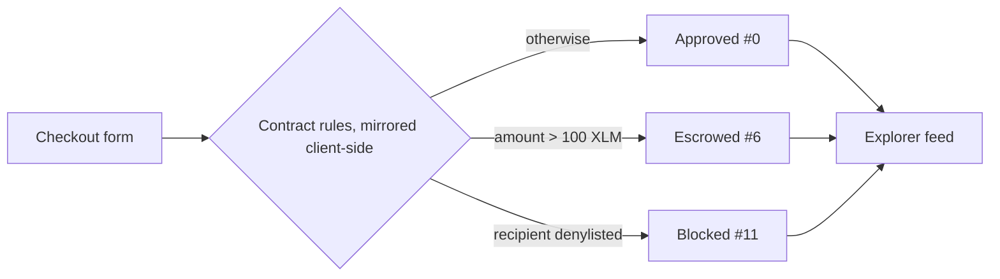

# Safeguard Dashboard

[](https://github.com/Safeguard-Inc/safeguard-dashboard/actions/workflows/ci.yml)
[](https://safeguard-dashboard-mocha.vercel.app)
[](https://nextjs.org)
[](LICENSE)

**Operator console for Safeguard policy-guarded payments on Stellar.** Try a
payment, see whether the contract would approve, escrow or block it, look
over the active rules, and browse recent activity.

**Live:** **<https://safeguard-dashboard-mocha.vercel.app>**

[](https://safeguard-docs.vercel.app/assets/video/safeguard-pitch.mp4)

---

## Table of contents

- [The Safeguard stack](#the-safeguard-stack)
- [Features](#features)
- [Try these scenarios](#try-these-scenarios)
- [How it works](#how-it-works)
- [Getting started](#getting-started)
- [Project structure](#project-structure)
- [Deployment](#deployment)
- [Project status and roadmap](#project-status-and-roadmap)
- [Contributing (Stellar Drips Wave)](#contributing-stellar-drips-wave)
- [License](#license)

---

## The Safeguard stack

| Repository | What it is | Tech |
| :--- | :--- | :--- |
| [`safeguard-contracts`](https://github.com/Safeguard-Inc/safeguard-contracts) | On-chain payments gateway, escrow and policy registry | Rust, Soroban SDK |
| [`safeguard-backend`](https://github.com/Safeguard-Inc/safeguard-backend) | TypeScript SDK and REST API | TypeScript, Express |
| **`safeguard-dashboard`** (this repo) | Operator console | Next.js 14, React 18, Tailwind |
| [`safeguard-docs`](https://github.com/Safeguard-Inc/safeguard-docs) | Docs site, live engine demo, pitch video | Static HTML/ESM |

## Features

| Tab | What you can do |
| :--- | :--- |
| **Payment Simulator & Checkout** | Enter a recipient and amount, get an Approved / Escrowed / Blocked verdict with the contract's reason code, and open the matching real Testnet transaction |
| **Policy Rules** | See the live contract configuration: 100 XLM spend cap, denylist screening, 24 h escrow timelock |
| **Explorer** | Activity feed seeded with the real Testnet transactions from the end-to-end run, with links to StellarExpert |

## Try these scenarios

The console uses the same addresses and limits as the live contract
[`CDC6KVX7…SRCN`](https://stellar.expert/explorer/testnet/contract/CDC6KVX7QT7CD3GOVGX44NQUNS7FMSZKIAXTV3TDGSXQKJRQMDZRSRCN):

| Scenario | Input | Verdict | Same outcome on chain |
| :--- | :--- | :--- | :--- |
| Normal payment | Compliant recipient, 50 XLM | ✅ Approved, code 0 | [`c762b42f…`](https://stellar.expert/explorer/testnet/tx/c762b42f818387aa584ea33d3da006f22671071ed6e182068994ea6597395e6c) |
| High value | Compliant recipient, 150 XLM | 🟡 Escrowed, code 6 | [`2d832316…`](https://stellar.expert/explorer/testnet/tx/2d83231685f03b17e1a001e6c82c38453459b4f67b416ef60f9be73133026f0e) |
| Denylisted | Blocked recipient preset | ⛔ Blocked, code 11 | Rejected at simulation, no fee |

## How it works



> [!NOTE]
> **Current scope: simulator.** Verdicts are computed in the browser using the
> same rule order as `SafeguardPayments.pay()`, and the wallet is a demo
> identity (the Testnet admin). Nothing is signed or submitted from the UI
> yet. Connecting Freighter and submitting real `pay()` transactions is the
> top roadmap item. `@stellar/freighter-api` is already a dependency.

## Getting started

**Prerequisites:** Node.js 20 or later.

```bash
git clone https://github.com/Safeguard-Inc/safeguard-dashboard
cd safeguard-dashboard
npm ci
npm run dev        # http://localhost:3000
```

| Script | Purpose |
| :--- | :--- |
| `npm run dev` | Dev server with hot reload |
| `npm run lint` | ESLint (`next/core-web-vitals`) |
| `npm run build` | Production build |
| `npm start` | Serve the production build |

## Project structure

```text
safeguard-dashboard/
├── src/app/
│   ├── layout.tsx       # Root layout, fonts, metadata
│   ├── page.tsx         # Console: checkout, policies, explorer tabs
│   └── globals.css      # Tailwind layers and theme
├── lib/errorCatalog.ts  # Error-code catalog (shared with safeguard-backend)
├── docs/ERROR_CODES.md  # Human-readable catalog
└── tailwind.config.ts
```

## Deployment

Hosted on **Vercel** (project `safeguard-dashboard`). CI in
[`.github/workflows/ci.yml`](.github/workflows/ci.yml) runs lint and build on
every push and pull request. Pushes to `main` deploy to
<https://safeguard-dashboard-mocha.vercel.app>.

## Project status and roadmap

| Status | Item |
| :---: | :--- |
| ✅ | Checkout simulator matching the live contract's rules and limits |
| ✅ | Policy view and activity feed backed by real Testnet transactions |
| 🔜 | **Freighter connect**: real wallet address and network check |
| 🔜 | **Submit real `pay()`** through the Stellar SDK, then show the receipt and tx link |
| 🔜 | Read `get_config` / `is_denylisted` from Soroban RPC instead of mirroring them |
| 🔜 | Escrow admin panel (`release_escrow` / `refund_escrow`) |
| 🔜 | Fetch the explorer feed from `safeguard-backend` `/api/transactions` |
| 🔜 | Component tests (Vitest + Testing Library) and Playwright smoke test |
| 🔜 | Accessibility pass and mobile layout |

## Contributing (Stellar Drips Wave)

Every roadmap item is a scoped issue:
[browse open issues](https://github.com/Safeguard-Inc/safeguard-dashboard/issues).
Comment to claim one, then fork and branch, and make sure `npm run lint` and
`npm run build` pass. See [CONTRIBUTING.md](CONTRIBUTING.md).

## License

[Apache-2.0](LICENSE)
